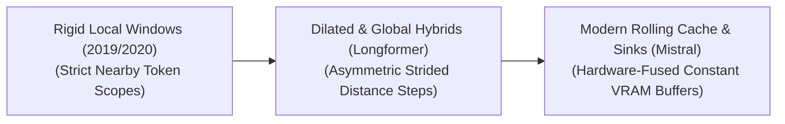

<!--
SEO Meta Details:
- Title: Awesome Sliding Window Attention Algorithms & Self-Play Models
- Description: A curated list of resources, papers, architectures, and applications for Sliding Window Attention, Local Attention, and Rolling Cache Transformers.
- Keywords: Sliding Window Attention, Local Attention, Transformer sparsification, Rolling KV Cache, Attention Sinks, StreamingLLM, Mistral 7B, Longformer, BigBird, Deep Learning
-->

# Awesome-Self-Play-Algorithms

## 🚀 Sliding Window Attention: Evolution, Variants, Types, & Applications

Sliding Window Attention—also known as Local Attention or Bounded Attention—is a structural sparsification framework designed to mitigate the quadratic computational complexity ($O(N^2)$) and VRAM bottlenecks of standard Full Self-Attention in Transformer architectures. In full attention, every token must compute an attention score with every other token in a sequence, making long-context processing (e.g., full books, high-resolution video clips, or massive source code repositories) highly inefficient. Sliding Window Attention restricts each token's attention field to a fixed, localized neighborhood (a "window") of adjacent tokens, dropping the computational and memory footprint down to true linear scaling ($O(N \times W)$), where $W$ is the window width.

---

## 📅 1. The Chronological Evolution

The implementation of sliding window mechanisms has evolved from rigid, localized text boundaries to multi-scale hybrid configurations and hardware-fused rolling buffers capable of maintaining long-range context without quadratic overhead.

| Era / Stage | Details | Year First Used | Paper Link |
| :--- | :--- | :--- | :--- |
| [**The Flat Heuristic Era (Early Local Attention, ~2019–2020)**](details/flat_heuristic_era.md) | *Concept:* Introduced in models like Child et al. (Sparse Transformers) and Sukhbaatar et al. (Adaptive Attention Span). Tokens were forced into strict, symmetric localized blocks. A token at index $i$ could only look at keys within $i \pm W/2$.  *Limitation:* Lacked global context mapping, severely limiting the model's ability to link distant themes or handle multi-turn narrative flows in early layers. | 2019 | [Sparse Transformers](https://arxiv.org/abs/1904.10509) |
| [**The Structured Hybrid Era (Longformer / BigBird, ~2020–2022)**](details/structured_hybrid_era.md) | *Concept:* Solved the isolation problem by combining sliding windows with global anchors (e.g., the `[CLS]` token) and dilated gaps. This allowed high-level abstract information to skip long distances across the sequence vector.  *Limitation:* Suffered from hardware implementation penalties, as unstructured or irregular sparse masks do not align well with dense GPU tensor core processing. | 2020 | [Longformer](https://arxiv.org/abs/2004.05150) / [BigBird](https://arxiv.org/abs/2007.14062) |
| [**The Modern Rolling Cache & Attention Sink Era (~2023–Present)**](details/modern_rolling_cache_era.md) | *Concept:* Popularized by architectures like **Mistral 7B** and algorithms like **StreamingLLM**. It refactored sliding window attention into a hardware-fused caching mechanism, using fixed-size rolling Key-Value (KV) buffers paired with permanent "attention sinks" to maintain linguistic stability indefinitely. | 2023 | [StreamingLLM](https://arxiv.org/abs/2309.17453) / [Mistral 7B](https://arxiv.org/abs/2310.06825) |

---

## 🧩 2. Core Functional & Structural Variants

Sliding window attention is deployed using distinct layout configurations that alter how information travels across the deep layers of a Transformer.

| Variant | Mechanism & Receptive Field / Pros | Year First Used | Paper Link |
| :--- | :--- | :--- | :--- |
| [**Standard Vanilla Sliding Window**](details/standard_vanilla_sliding_window.md) | *Mechanism:* A rigid, symmetric mask where the attention scope is bounded tightly around the target token.  *Receptive Field Expansion:* While a single layer is strictly localized, stacking $L$ layers creates a deep hierarchical architecture. The effective receptive field expands linearly with depth ($L \times W$), allowing the top layers to naturally capture long-range semantic dependencies. | 2019 | [Sparse Transformers](https://arxiv.org/abs/1904.10509) |
| [**Dilated / Strided Sliding Window**](details/dilated_sliding_window.md) | *Mechanism:* The sliding window skips adjacent tokens at a regular, fixed periodic interval (e.g., checking keys at indices $i-2, i-4, i-6$ within a window).  *Pros:* Doubles or quadruples the visual or textual span of the window without expanding the absolute token calculation budget. | 2019 | [Sparse Transformers](https://arxiv.org/abs/1904.10509) |
| [**Asymmetric Causal Sliding Window**](details/asymmetric_causal_sliding_window.md) | *Mechanism:* Tailored for autoregressive generation models. The window opens exclusively backward into historical tokens (e.g., a token at index $i$ attends to indices from $i-W$ to $i$), completely masking out future tokens. | 2019 | [Sparse Transformers](https://arxiv.org/abs/1904.10509) |

---

## 💾 3. High-Yield Cache Management Types

Managing the Key-Value (KV) cache during continuous sliding window inference dictates the latency profile and memory consumption of production systems.

| Type | Mechanism & Pros | Year First Used | Paper Link |
| :--- | :--- | :--- | :--- |
| [**Rolling KV Cache (Mistral Framework)**](details/rolling_kv_cache.md) | *Mechanism:* The system maintains a fixed-capacity VRAM cache equal to the window size $W$. When generating token $i$, its KV coordinates overwrite the memory slot of token $i-W$ using a modulo operation (`i % W`).  *Pros:* Completely bounds KV cache VRAM inflation. VRAM consumption remains flat and unchanging whether the model generates 100 tokens or 100,000 tokens. | 2023 | [Mistral 7B](https://arxiv.org/abs/2310.06825) |
| [**Attention Sink Augmentation (StreamingLLM)**](details/attention_sink_augmentation.md) | *Mechanism:* Discovers that the absolute first 2 to 4 tokens in a sequence act as an "attention sink," absorbing massive amounts of attention gravity. The cache keeps these initial tokens permanently frozen in memory, while applying a sliding rolling window to all subsequent generations.  *Pros:* Prevents catastrophic perplexity explosions during infinitely long streaming text generation loops. | 2023 | [StreamingLLM](https://arxiv.org/abs/2309.17453) |

---

## ⚙️ 4. Production Engineering Challenges & Hardware Trade-Offs

While sliding window attention provides a clear mathematical optimization path, hardware integration presents distinct engineering constraints.

| Challenge / Trade-Off | Problem & Mitigation | Year First Used | Paper Link |
| :--- | :--- | :--- | :--- |
| [**The FlashAttention Kernel Compatibility Gap**](details/flashattention_compatibility_gap.md) | *The Problem:* Standard sliding window masks introduce non-contiguous memory reading indexing. If executed naively, the GPU spends too much time fetching disjointed tensor addresses, erasing theoretical speedups.  *Mitigation:* Utilizing **Block-Local FlashAttention Kernels** (like those in vLLM or Hugging Face Text Generation Inference), which execute the sliding window constraints over coarse, contiguous $64 \times 64$ block tiles rather than individual token matrices. | 2022 | [FlashAttention](https://arxiv.org/abs/2205.14135) |
| [**The Distant Retrieval Loss (The "Goldfish Memory" Penalty)**](details/distant_retrieval_loss.md) | *The Problem:* If a user prompt requires retrieving a highly specific fact buried deep in a 50,000-word document, a standard sliding window model will discard that information from its rolling cache before it reaches the generation layer.  *Mitigation:* Restricting sliding window execution strictly to intermediate encoder layers, while forcing terminal cross-attention blocks to maintain full, un-sparsified attention visibility. | 2023 | [StreamingLLM](https://arxiv.org/abs/2309.17453) |

---

## 🌟 5. Frontier Real-World Applications

| Application | Description / Context | Year First Used | Paper Link |
| :--- | :--- | :--- | :--- |
| [**Continuous Real-Time Streaming Log Analysis**](details/streaming_log_analysis.md) | Monitors high-volume enterprise server logs or active network traffic pipelines 24/7. Rolling sliding window models parse incoming signal strings continuously, flagging security anomalies based on local context windows without overloading system RAM over weeks of operation. | 2023 | [StreamingLLM](https://arxiv.org/abs/2309.17453) |
| [**Edge Device Conversational Assistants**](details/edge_device_assistants.md) | Deployed on consumer laptops, smartphones, or smart home devices. Limiting the KV cache to a strict local rolling window allows compact models to maintain infinite multi-turn conversations without saturating the device's restricted unified memory architecture. | 2023 | [Mistral 7B](https://arxiv.org/abs/2310.06825) |
| [**High-Frame-Rate Video Comprehension**](details/video_comprehension.md) | Processes long security or autonomous driving camera feeds. Because video features exhibit massive temporal redundancy between adjacent frames, a temporal sliding window attention layer focuses the model's capacity on short-range motion transitions, ignoring frames from hours prior. | 2020 | [Longformer](https://arxiv.org/abs/2004.05150) |

---

## 📚 References
1. Child, R., Gray, S., Radford, A., & Sutskever, I. (2019). Generating long sequences with sparse transformers. *arXiv preprint arXiv:1904.10509*.
2. Beltagy, I., Peters, M. E., & Cohan, A. (2020). Longformer: The long-document transformer. *arXiv preprint arXiv:2004.05150*.
3. Zaheer, M., et al. (2020). Big bird: Transformers for longer sequences. *Advances in Neural Information Processing Systems (NeurIPS)*, 33, 17271-17239.
4. Jiang, A. Q., et al. (2023). Mistral 7B. *arXiv preprint arXiv:2310.06825*.
5. Xiao, G., Han, Y., Sheng, Y., & Song, H. (2023). Efficient streaming language models with attention sinks. *arXiv preprint arXiv:2309.17453*.

---

To advance your documentation repository, structural setup, or deployment architecture, consider exploring these adjacent development pathways:
* Build a **Python code snippet using PyTorch** illustrating how to generate a causal rolling sliding-window mask matrix template from scratch.
* Generate a **comprehensive Markdown table** explicitly analyzing Standard Sliding Window, Dilated Window, Full Attention, and Attention Sink architectures across cache size limits, computational time complexity, and long-range retrieval fidelity.
* Establish a **performance profiling notebook using Triton** to benchmark the exact wall-clock throughput and VRAM saving bounds achieved when compiling block-sparse sliding window kernels directly into fast registers.

