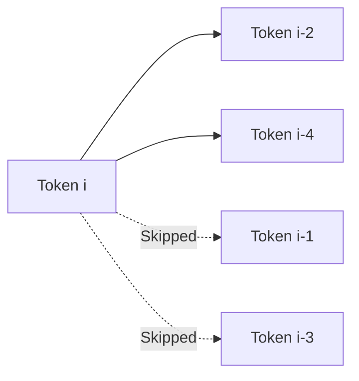

# Dilated / Strided Sliding Window

## Overview
Dilated attention expands the receptive field of local attention windows without increasing the number of computations.

## Technical Concept
By skipping adjacent tokens at a regular interval (dilation rate $D$), a token at index $i$ only attends to keys at indices:
$$i - D \times k$$
where $k$ is the step index within the window.

---
[← Back to README](../README.md)
