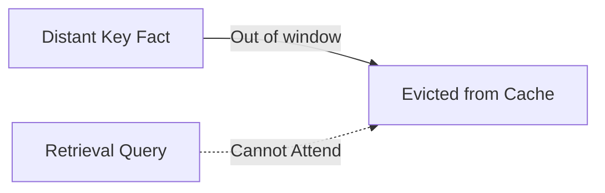

# The Distant Retrieval Loss (The "Goldfish Memory" Penalty)

## Overview
A core limitation of localized windows: they drop key historical information from the KV cache, making needle-in-a-haystack retrieval difficult.

## Technical Concept
When a factual token falls out of the sliding window, the model cannot retrieve it. Hybrid structures restrict the sliding window to lower layers and use full attention in the final layers to preserve recall.

---
[← Back to README](../README.md)
