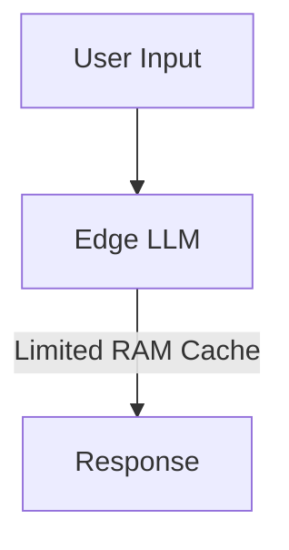

# Edge Device Conversational Assistants

## Overview
Edge devices like smartphones have strict memory budgets. Sliding window attention enables conversational assistants on edge hardware.

## Technical Concept
Limiting the KV cache size using a sliding window bounds the memory footprint, ensuring the assistant can maintain long multi-turn conversations without saturating the device's unified RAM.

---
[← Back to README](../README.md)
