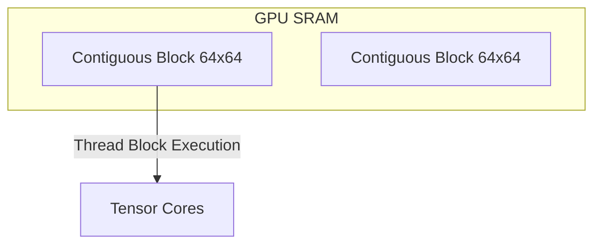

# The FlashAttention Kernel Compatibility Gap

## Overview
Naively masking sliding windows leads to non-contiguous memory access patterns, preventing standard FlashAttention from achieving maximum speedups.

## Technical Concept
Because FlashAttention relies on tiling and loading blocks into fast SRAM, non-standard sliding masks break cache alignment. Modern systems mitigate this by running the mask over block-sparse layouts (e.g., $64 \times 64$ tiles).

---
[← Back to README](../README.md)
