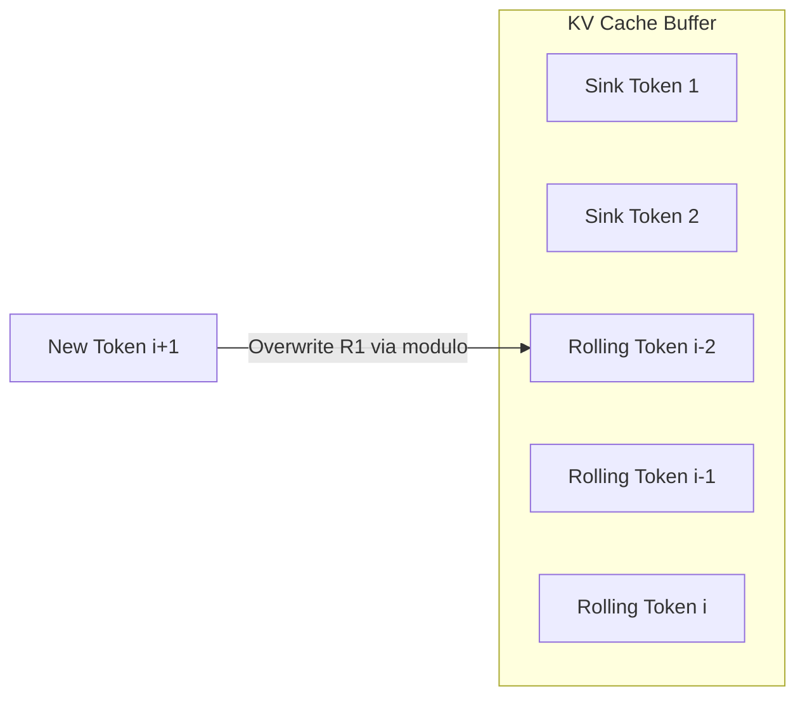

# The Modern Rolling Cache & Attention Sink Era (~2023–Present)

## Overview
Modern architectures optimize sliding windows by coupling them with hardware-fused caching. This preserves VRAM limits while utilizing permanent "attention sinks" to maintain linguistic stability during infinite text generation.

## Technical Concept
During generation, the Key-Value (KV) cache is restricted to a fixed size $W$. An attention sink (typically the first few tokens of the prompt) is kept in the cache permanently, preventing catastrophic perplexity spikes.

## Advantages
* Stable perplexity at extreme sequence lengths.
* $O(1)$ memory growth relative to generation length.

---
[← Back to README](../README.md)
