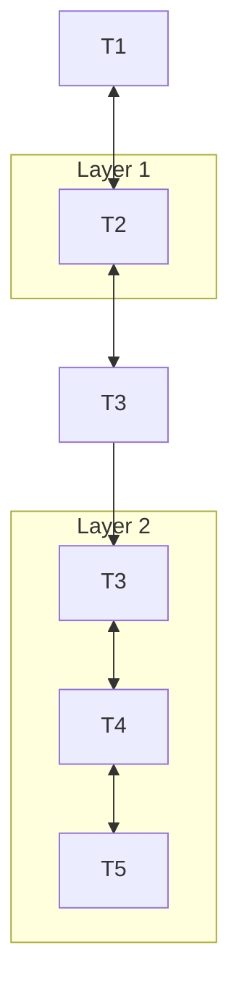

# Standard Vanilla Sliding Window

## Overview
A baseline implementation where attention is restricted to a symmetric local neighborhood centered around each token.

## Technical Concept
Stacking multiple layers ($L$) of sliding window attention ($W$) allows the receptive field to expand linearly with depth. At layer $L$, a token can receive information from up to $L \times W$ tokens away.

---
[← Back to README](../README.md)
