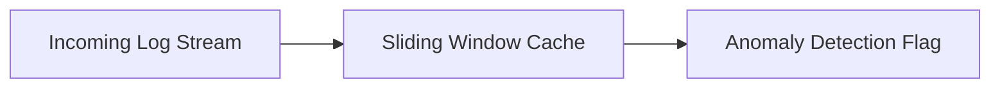

# Continuous Real-Time Streaming Log Analysis

## Overview
Streaming LLMs allow log parsing systems to run indefinitely without hitting out-of-memory errors due to cache growth.

## Technical Concept
As system logs stream in continuously, sliding windows identify local correlations (e.g. error sequences within 100 lines) without storing all history since server boot.

---
[← Back to README](../README.md)
